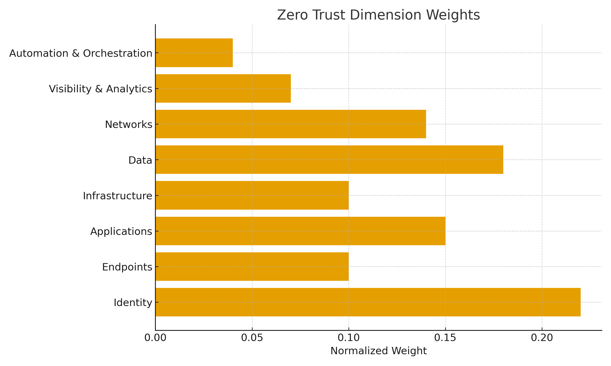

# Developing a Zero Trust Readiness Index (ZTRI)
**A framework to measure enterprise-wide Zero Trust adoption (Group - 2 - CSM)**

---

## Loom Presentation Videos
| Member | Loom Link |
|:-------|:-----------|
| **Parth** | [Watch Here](https://www.loom.com/share/af1d304fdf574925b61a85a44b115258) |
| **Jenish** | [Watch Here](https://www.loom.com/share/69b10800efa84642bb3a9e3217b5ba56) |

---

## Project Overview
This repository shows a complete implementation of the **Zero Trust Readiness Index (ZTRI)** a systematic, data-driven method to calculate how ready an organization is to adopt or enhance a **Zero Trust Architecture (ZTA)**.

The project combines **academic research** and **practical scoring tools** to calculate a readiness score (0–5) across **8 key Zero Trust dimensions**, using a **Systematic Literature Review (SLR)** method.

---

## Research Summary

### Objective
To design a **Zero Trust Readiness Index (ZTRI)** that:
- Quantifies readiness using weighted maturity scores.
- Identifies organizational strengths and gaps across Zero Trust dimensions.
- Provides a consistent measurement method aligned with modern ZTA principles.

### Methodology
1. Conducted a **Systematic Literature Review (SLR)** of 10 Zero Trust–related research papers.
2. Extracted **8 common Zero Trust dimensions**:
   - Identity  
   - Endpoints  
   - Applications  
   - Infrastructure  
   - Data  
   - Networks  
   - Visibility & Analytics  
   - Automation & Orchestration
3. Counted dimension frequencies (Critical, High, Medium) across all papers.
4. Normalized frequency totals to produce **weighted importance values (sum = 1.00)**.
5. Created a **scoring model (0–5)** and an Excel tool to automate readiness evaluation.

---

## Scoring Model

| Score | Category | Description |
|:------:|-----------|-------------|
| 0 | Non-Existent | No implementation or awareness. |
| 1 | Initial | Early-stage, ad-hoc efforts. |
| 2 | Basic | Defined goals but inconsistent practices. |
| 3 | Intermediate | Structured and measurable controls. |
| 4 | Advanced | Integrated Zero Trust adoption. |
| 5 | Optimised | Fully automated and monitored ZT ecosystem. |

### Formula
```
Weighted Score = Dimension Weight × Dimension Score
Total Readiness = Σ (Weighted Scores)
```

The resulting **Total Readiness Score (0–5)** is automatically classified into the readiness category.

---

## Repository Structure

```
├── 📁 data/
│   ├── 01_Paper_Dimension_Frequency_Table.csv        → Raw data from 10 papers
│   └── 02_ZTRI_Weights_Normalization.csv             → Normalized weights (sum ≈ 1.00)
│
├── 📁 docs/
│   ├── 01_Weight_Calculation.md                   → Show how frequencies were normalized
│   ├── 02_Readiness_Scoring_Logic.md              → Scoring formula and readiness mapping
│   └── 03_Findings_and_Interpretation.md          → Key insights and frequency interpretation
│
├── 📁 analysis/
│   └── ztri_formula_explanation.md                → Calculation logic & formulas
│
├── 📁 excel-model/
│   └── ZTRI_Scoring_Model_v1.xlsx                 → Interactive Excel scoring tool
│
├── 📁 visuals/
│   ├── dimension_weights_chart.png                → Weights visualization
│   ├── readiness_scale.png                        → Readiness scale (0–5)
│   └── ztri_architecture.png                      → Architecture overview
│
└── README.md                                      → You are here
```

---

## How to Use


---

## Example Output

| Dimension | Weight | Score | Weighted Score |
|------------|---------|-------|----------------|
| Identity | 0.22 | 4 | 0.88 |
| Data | 0.18 | 3 | 0.54 |
| Applications | 0.15 | 3 | 0.45 |
| Endpoints | 0.10 | 2 | 0.20 |
| Infrastructure | 0.10 | 3 | 0.30 |
| Networks | 0.14 | 4 | 0.56 |
| Visibility & Analytics | 0.07 | 2 | 0.14 |
| Automation & Orchestration | 0.04 | 1 | 0.04 |
| **Total Readiness Score** | | | **3.11 / 5 (Intermediate)** |

---

## Visual Overview

<p align="center">
  <br>
  <em>Normalized Dimension Weights (Σ = 1.00)</em>
</p>

---

Authors:

  1) Parth Kadiya  
  MS Cyber Forensics and Security  
🔗 [GitHub](https://github.com/ParthKadiya) • [LinkedIn](https://www.linkedin.com/in/parthkadiya/)

  2) Jenish Patel  
  MS Applied Cybersecurity and Digital Forensics  
🔗 [GitHub](https://github.com/JenishPatel08) • [LinkedIn](https://www.linkedin.com/in/jenish-patel-91ba32316/)
